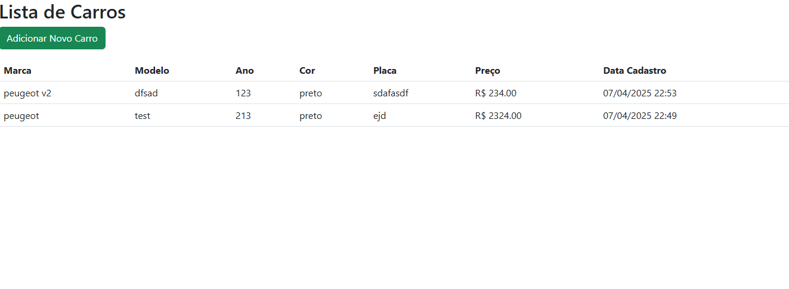
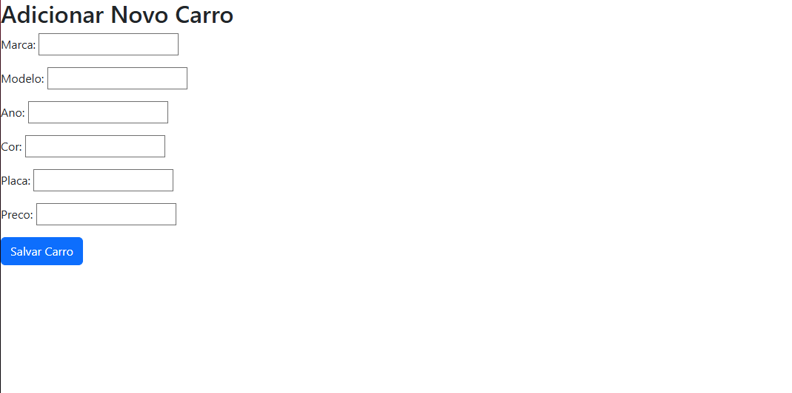

Sistema de Cadastro de Carros com Django e PostgreSQL no Docker
Descrição
Este projeto é um sistema simples de cadastro de veículos desenvolvido com:

Django (backend)

PostgreSQL (banco de dados)

Docker (containerização do banco de dados)

Pré-requisitos
Docker e Docker Compose instalados

Python 3.8+

Pip

Configuração Inicial
Clone o repositório:

bash
Copy
git clone [URL_DO_REPOSITORIO]
cd nome-do-projeto
Crie um ambiente virtual (recomendado):

bash
Copy
python -m venv venv
source venv/bin/activate  # Linux/Mac
# ou
venv\Scripts\activate     # Windows
Instale as dependências:

bash
Copy
pip install -r requirements.txt
Configuração do PostgreSQL no Docker
Inicie o container do PostgreSQL:

bash
Copy
docker-compose up -d
Verifique se o container está rodando:

bash
Copy
docker ps
Configuração do Ambiente
Crie um arquivo .env na raiz do projeto baseado no .env.example:

bash
Copy
cp .env.example .env
Edite o .env com suas configurações (as padrão já funcionam com o Docker Compose fornecido):

Copy
DB_ENGINE=django.db.backends.postgresql
DB_NAME=faculdade
DB_USER=admin
DB_PASSWORD=admin
DB_HOST=db
DB_PORT=5433
Migrações e Superusuário
Aplique as migrações:

bash
Copy
python manage.py migrate
Crie um superusuário (opcional):

bash
Copy
python manage.py createsuperuser
Executando o Projeto
Inicie o servidor Django:

bash
Copy
python manage.py runserver
Acesse no navegador:

Aplicação: http://localhost:8000/carros/

Admin: http://localhost:8000/admin/ (se criou superusuário)

Docker Compose
O arquivo docker-compose.yml contém:

yaml
Copy
version: '3.8'

services:
  db:
    image: postgres:13
    environment:
      POSTGRES_DB: faculdade
      POSTGRES_USER: admin
      POSTGRES_PASSWORD: admin
    ports:
      - "5433:5432"
    volumes:
      - postgres_data:/var/lib/postgresql/data

volumes:
  postgres_data:
Rotas Disponíveis
/carros/adicionar/ - Formulário para adicionar novo carro

/carros/ - Lista todos os carros cadastrados

/admin/ - Painel administrativo (se habilitado)

Como Contribuir
Faça um fork do projeto

Crie uma branch para sua feature (git checkout -b feature/fooBar)

Commit suas mudanças (git commit -am 'Add some fooBar')

Push para a branch (git push origin feature/fooBar)

Crie um novo Pull Request

